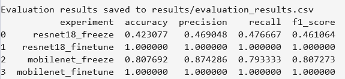

# Pokemon 이미지 분류 #

## 프로젝트 개요 ##
포켓몬 이미지를 입력받고, 해당 포켓몬의 이름을 분류하는 모델을 구현하였다.
2개의 모델(ResNet18, MobileNetV3)로 4개의 실험을 설정하여 성능을 비교하였다.

## 실험 종류 ##
- resnet18_freeze
- resnet18_finetune
- mobilenet_freeze
- mobilenet_finetune

## 실험 4개의 성능 비교 ##
모델 성능 평가는 Accuracy, Precision, Recall, F1-score을 지표로 이용하였다.

## Learning Curve ##
### ResNet18_Freeze ###

### ResNet18_Finetune ###

### MobileNet_Freeze ###

### MobileNet_Finetune ###

