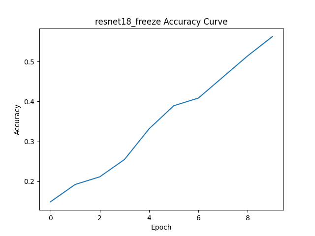
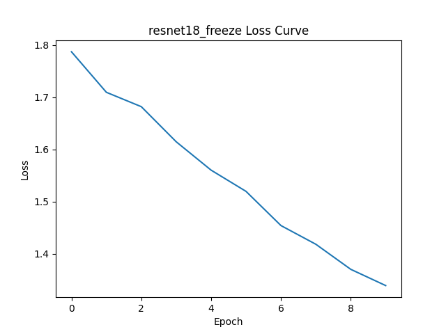
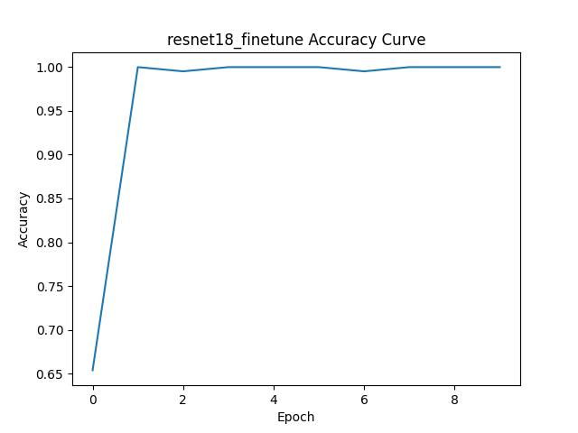
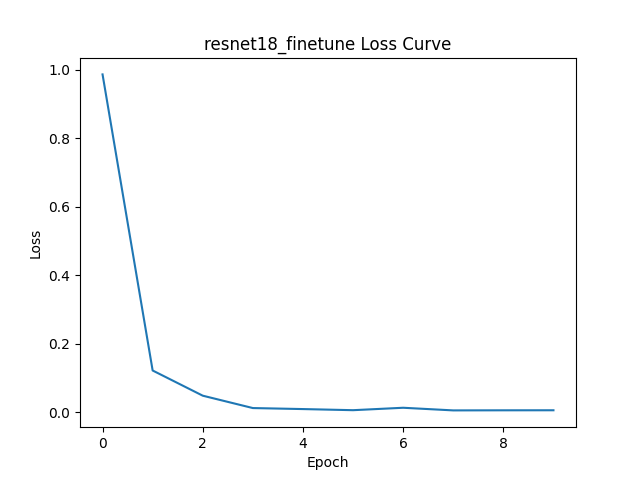
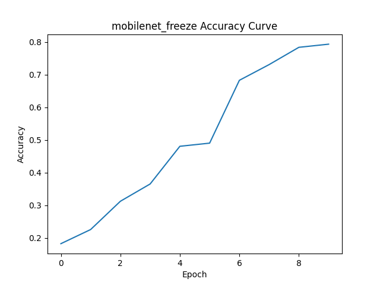
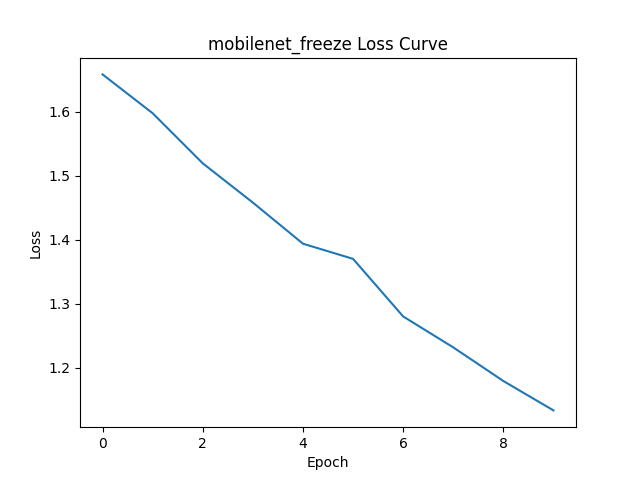
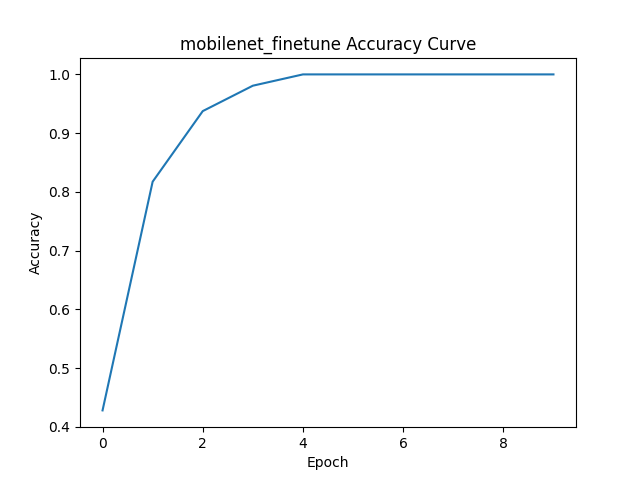
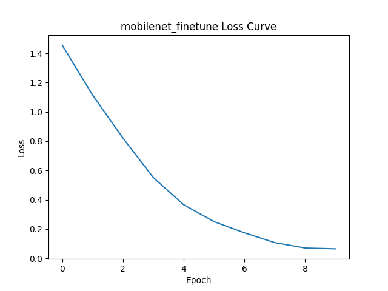
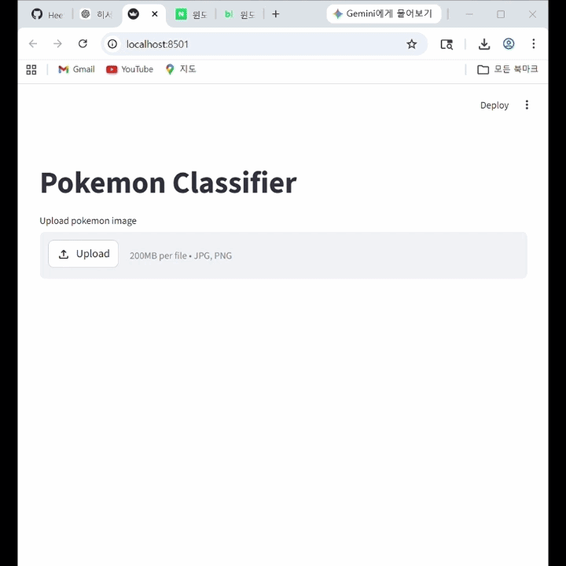

# Pokemon 이미지 분류 #

## 프로젝트 개요 ##
포켓몬 이미지를 입력받고, 해당 포켓몬의 이름을 분류하는 모델을 구현하였다.
2개의 모델(ResNet18, MobileNetV3)로 4개의 실험을 설정하여 성능을 비교하였다.

포켓몬 데이터는 아래 주소에서 다운받아 사용하였다.
https://www.kaggle.com/datasets/lantian773030/pokemonclassification

## 실험 종류 ##
- resnet18_freeze
- resnet18_finetune
- mobilenet_freeze
- mobilenet_finetune

## 실험 4개의 성능 비교 결과 ##
성능 비교의 결과로는 Finetuning을 적용한 모델이 Freeze 방식보다 일반적으로 더 높은 성능을 보였다.

## Learning Curve ##
### ResNet18_Freeze ###
- Accuracy는 가장 낮은 수준이다.
- Loss의 감소도 가장 느리다.
- 가장 성능이 낮은 설정이다.
 

### ResNet18_Finetune ###
- Accuracy는 초기부터 빠르게 상승하여 거의 100%에 도달한다.
- Loss는 급격히 감소하여 0에 근접한다.
- 가장 빠르게 수렴하며 최고 성능을 보인다. 매우 잘 학습된 상태이다.

### MobileNet_Freeze ###
- Accuracy가 점진적으로 증가한다.
- Loss 감소 속도가 상대적으로 느리다.
- Finetuning 대비 성능 저하가 확인된다.

### MobileNet_Finetune ###
- Accuracy가 점진적으로 상승하여 100%에 근접한다.
- Loss도 지속적으로 감소하여 안정적으로 수렴한다.
- 느리지만 안정적인 학습 모델이다.

## Streamlit을 이용한 데모 GUI ##
이미지를 업로드하면, Top-5 예측 결과가 출력되며, Top-1로 결과가 표시된다.

## 실행방법 ##
- 라이브러리 설치: pip install -r requirements.txt
- 모델 학습: python -m src.train
- 성능 평가: python -m src.evaluate
- GUI 실행: python -m streamlit run app.py
